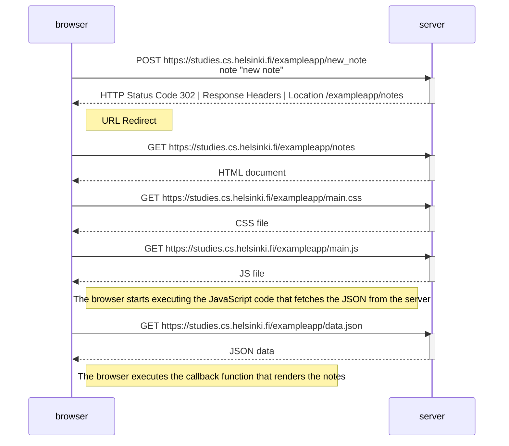

```mermaid
sequenceDiagram
participant browser
participant server

     browser->>server: POST https://studies.cs.helsinki.fi/exampleapp/new_note<br/>note "new note"
     activate server
     server-->>browser: HTTP Status Code 302 | Response Headers | Location /exampleapp/notes
     deactivate server

     Note right of browser: URL Redirect

     browser->>server: GET https://studies.cs.helsinki.fi/exampleapp/notes
     activate server
     server-->>browser: HTML document
     deactivate server

     browser->>server: GET https://studies.cs.helsinki.fi/exampleapp/main.css
     activate server
     server-->>browser: CSS file
     deactivate server

     browser->>server: GET https://studies.cs.helsinki.fi/exampleapp/main.js
     activate server
     server-->>browser: JS file
     deactivate server

    Note right of browser: The browser starts executing the JavaScript code that fetches the JSON from the server

     browser->>server: GET https://studies.cs.helsinki.fi/exampleapp/data.json
     activate server
     server-->>browser: JSON data
     deactivate server

     Note right of browser: The browser executes the callback function that renders the notes
```
