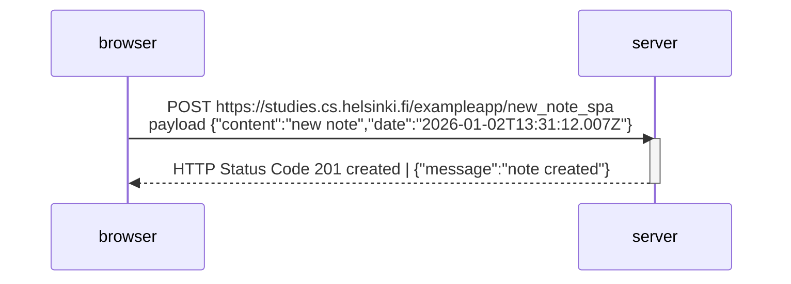

```mermaid
sequenceDiagram
participant browser
participant server

     browser->>server: POST https://studies.cs.helsinki.fi/exampleapp/new_note_spa<br/>payload {"content":"new note","date":"2026-01-02T13:31:12.007Z"}
     activate server
     server-->>browser: HTTP Status Code 201 created | {"message":"note created"}
     deactivate server
```
